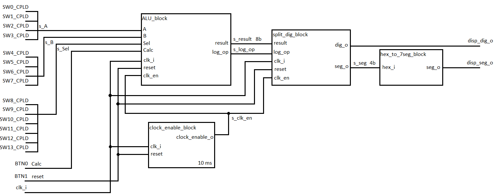

# Projekt: Vlastní ALU (Arithmetic Logic Unit)

### Obsah:
   1. [Zadání](#Zadání:)
   2. [Kód](#Kód:)
   3. [Schéma](#Schéma:)
   4. []

### Zadání:
Možnost výběru instrukcí a vstupních hodnot za chodu aplikace. Výstup na 7segmentovém displeji.

### Kód: 
ALU obsahuje 4 bloky:   
* ALU_block
* split_dig_block
* clock_enable_block
* hex_to_7seg_block

#### ALU:
ALU blok se stará o výpočety a logické operace. Má 2 vstupní 4 bitové registry A,B, 6 bitový registr Sel pro výběr operací a 8 bitový výstupní signál result a signál log_op.

#### Split_dig:
Tento blok má na starosti rozdělení výsledku na jednotlivé číslice (stovky, desítky, jednotky) a jejich výpis na displej. Obsahuje 1 vstupní signál result a příznak log_op, který blok informuje o tom, zda-li probíhala logická operace (AND, OR). Na výstupu jsou 2 signály dig_o a seg_o. Signál dig_o udává, na který sedmi-segmentový displej se bude hodnota vypisovat a signál seg_o obsahuje hodnotu, která se má vypsat.

#### Clock_enable:
**Blok má výstupní signál clock_enable_o, který synchronizuje ostatní bloky. Je možné nastavit s jakou frekvencí bude blok vysílat synchronní impulz.** Na vstupu se nachází signál připojený k vnitřním hodinám mikroprocesoru clk_i a reset připojený na tlačítko *BTN1*.

#### Hex_to_7seg:
**Hex_to_7seg jednoduše převádí přijatou vstupní hodnotu z bloku split_dig na sedmi_segmentové číslo a to posílá na sedmi_segmentový displej.**

### Schéma:

###

**Dont read me yet**
