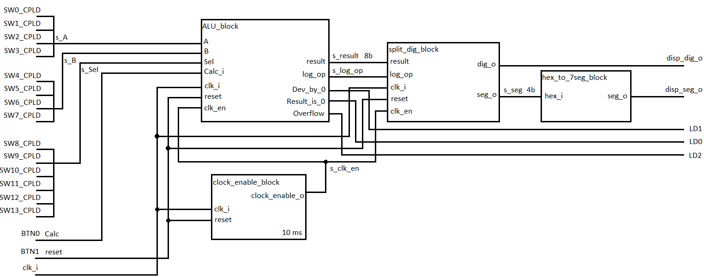
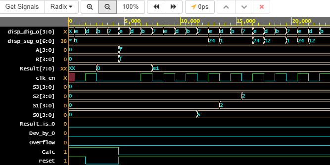
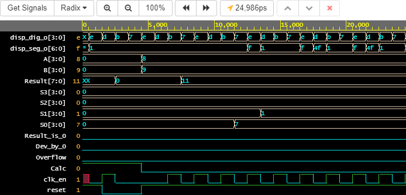
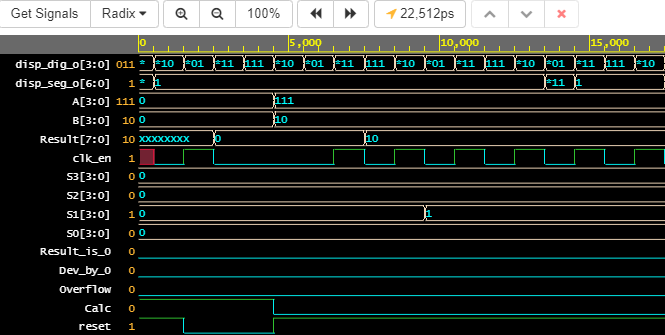

# Projekt: Vlastní ALU (Arithmetic Logic Unit)

### Obsah:
   1. [Zadání](#Zadání:)
   2. [Kód](#Kód:)
   3. [Schéma](#Schéma:)
   4. [Simulace](#Simulace:)
   5. [Odkazy](#Odkazy:)
   

### Zadání:
Možnost výběru instrukcí a vstupních hodnot za chodu aplikace. Výstup na 7segmentovém displeji.

### Kód: 
ALU obsahuje 4 bloky:   
* ALU_block
* split_dig_block
* clock_enable_block
* hex_to_7seg_block

#### ALU:
ALU blok se stará o výpočety a logické operace. Má 2 vstupní 4 bitové registry A,B, 6 bitový registr Sel pro výběr operací a 8 bitový výstupní signál result a signál log_op.

#### Split_dig:
Tento blok má na starosti rozdělení výsledku na jednotlivé číslice (stovky, desítky, jednotky) a jejich výpis na displej. Obsahuje 1 vstupní signál result a příznak log_op, který blok informuje o tom, zda-li probíhala logická operace (AND, OR). Na výstupu jsou 2 signály dig_o a seg_o. Signál dig_o udává, na který sedmi-segmentový displej se bude hodnota vypisovat a signál seg_o obsahuje hodnotu, která se má vypsat.

#### Clock_enable:
**Blok má výstupní signál clock_enable_o, který synchronizuje ostatní bloky. Je možné nastavit s jakou frekvencí bude blok vysílat synchronní impulz.** Na vstupu se nachází signál připojený k vnitřním hodinám mikroprocesoru clk_i a reset připojený na tlačítko *BTN1*.

#### Hex_to_7seg:
**Hex_to_7seg jednoduše převádí přijatou vstupní hodnotu z bloku split_dig na sedmi_segmentové číslo a to posílá na sedmi_segmentový displej.**

### Schéma:

### Simulace:
#### Násobení:

| Registr| Hex | Bin | Dec |
| ---- | ---- | ---- | ---- |
| A | 8 | 1000 | 8 |
| B | 9 | 1001 | 9 |
| Result | 48 | 1001000 | 72 |
Na simulaci můžeme vidět, že segment 0 (S0) nabyde hodnoty '2' a segment 1 (S1) hodnoty '7'.

#### Sčítání:

| Registr| Hex | Bin | Dec |
| ---- | ---- | ---- | ---- |
| A | 9 | 1001 | 9 |
| B | 4 | 0100 | 4 |
| Result | b | 1101 | 13 |

#### AND:

| Registr| Hex | Bin | Dec |
| ---- | ---- | ---- | ---- |
| A | 3 | 0011 | 3 |
| B | 9 | 1001 | 9 |
| Result | 1 | 0001 | 1 |

### Odkazy:

**Testovací playground**     
https://www.edaplayground.com/x/2QWc

**Playground s kódem upraveným pro Coolrunner mikroprocesor**     
https://www.edaplayground.com/x/2e67

#### Inspirace
https://electronics.stackexchange.com/questions/320416/how-to-break-multi-digit-number-into-separate-digits-in-vhdl     
_Rozdělení čísla na jednotky, desítky, stovky_

https://stackoverflow.com/questions/33264066/what-to-unsigned-does     
_to_unsigned_

https://www.csee.umbc.edu/portal/help/VHDL/numeric_std.vhdl     
_resize funkce_

https://vhdlwhiz.com/signed-unsigned/    
_signed a unsigned_ 

**Dont read me yet**

