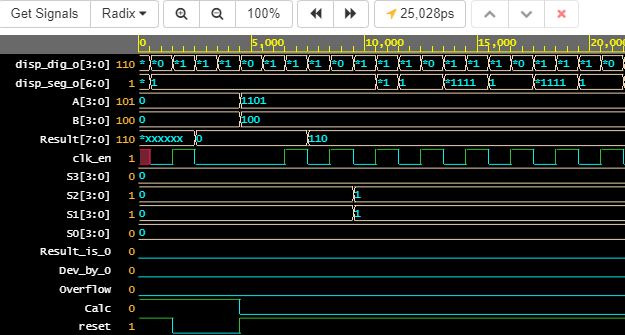

# Projekt: ALU (Arithmetic Logic Unit)
#### Co je ALU:
ALU nebo-li Aritmeticko-Logická jednotka, je kombinační digitální elektronický obvod, který provádí aritmetické a logické bitové operace. ALU se dnes využívá v mnoha elektronických zařízeních, převážně však v procesorech a mikroprocesorech. 

### Obsah:
   1. [Zadání](#Zadání:)
   2. [Kód](#Kód:)
   3. [Schéma](#Schéma:)
   4. [Simulace](#Simulace:)
   5. [Odkazy](#Odkazy:)

## Zadání:
Možnost výběru instrukcí a vstupních hodnot za chodu aplikace. Výstup na 7segmentovém displeji.

## Kód: 
Kód obsahuje 4 hlavní bloky:   
* ALU
* split_dig
* clock_enable
* hex_to_7seg

#### ALU:
ALU blok se stará o výpočety a logické operace. Má 2 vstupní 4 bitové registry A,B, 4 bitový registr Sel pro výběr operací a 8 bitový výstupní signál result. Dále signál log_op a příznaky Result_is_0, Dev_by_0 a Overflow, příznaky jsou připojené na 3 LED diody. Obsahuje také vstupní signál Calc_i připojený na tlačítko _BTN0_, který má představovat synchronní příchod dat a řídících signálů do ALU.

#### Split_dig:
Tento blok má na starosti rozdělení výsledku na jednotlivé číslice (stovky, desítky, jednotky) a jejich výpis na displej. Obsahuje 1 vstupní signál result a příznak log_op, který blok informuje o tom, zda-li probíhala logická operace (AND, OR, XOR atd.). Na výstupu jsou 2 signály dig_o a seg_o. Signál dig_o udává, na který sedmi-segmentový displej se bude hodnota vypisovat a signál seg_o obsahuje hodnotu, která se má vypsat.

#### Clock_enable:
Blok má výstupní signál clock_enable_o, který slouží k synchronizaci ostatních bloků. Je možné nastavit s jakou frekvencí bude blok vysílat synchronní impulz. Na vstupu se nachází signál připojený k vnitřním hodinám mikroprocesoru clk_i a reset připojený na tlačítko *BTN1*.

#### Hex_to_7seg:
Hex_to_7seg slouží k převodu přijaté vstupní hodnoty, která přijde na port hex_i z bloku split_dig na sedmi-segmentové číslo a to se dále posílá na sedmi-segmentový displej.

#### Instrukce:
| Binární kód instrukce (Sel) | Zkratka | Popis |
| ------ | ----- | ------ |
| 0000 | MIN | Na výstup předá nižší ze dvou čísel |
| 1111 | MAX | Na výstup předá vyšší ze dvou čísel |
| 0001 | ADD | Součet regitru A a B |
| 0010 | SUB | Odečte registr B od registru A |
| 0100 | MULT | Násobení registru A a B |
| 1000 | DEV | Dělení obsahu registru A registrem B |
| 1010 | INC | Inkrementace registru A |
| 0101 | DEC | Dektrementace registru A |
| 0110 | ROR | Posun obsahu registru A o jedno do prava |
| 0111 | ROL | Posun obsahu registru A o jedno do leva |
| 1100 | AND | Operace A AND B |
| 1011 | NAND | Operace A NAND B |
| 1001 | OR | Operace A OR B |
| 0011 | NOR | Operace A NOR B |
| 1110 | XOR | Operace A XOR B |
| 1101 | XNOR | Operace A XNOR B |

## Schéma:

## Simulace:

   
 Matematické operace 

   &nbsp;
   
 
   
 Sčítání 

   
   
   
   | Registr | BIN | HEX | DEC | 
   | ----- | ---- | ---- | --- | 
   | A | 1000 | 8 | 8 |
   | B | 1001 | 9 | 9 |
   | Result | 10001 | 11 | 17 |

   

   
   
 
   
 Odčítání 

   
   
   
   | Registr | BIN | HEX | DEC | 
   | ----- | ---- | ---- | --- | 
   | A | 1111 | f | 15 |
   | B | 1001 | 9 | 9 |
   | Result | 0110 | 6 | 6 |
   
   
   
   | Registr | BIN | HEX | DEC | 
   | ----- | ---- | ---- | --- | 
   | A | 0100 | 4 | 4 |
   | B | 1001 | 9 | 9 |
   | Result | 0000 | 0 | 0 |

   _Overflow příznak je v hodnotě '1', protože došlo k přetečení._
   

   
   
 
   
 Násobení 

  
   

   | Registr | BIN | HEX | DEC | 
   | ----- | ---- | ---- | --- | 
   | A | 1111 | f | 15 |
   | B | 1111 | f | 15 |
   | Result | 11100001 | e1 | 225 |
   

   
   
 
   
 Dělení 

   
   
   
   | Registr | BIN | HEX | DEC | 
   | ----- | ---- | ---- | --- | 
   | A | 1000 | 8 | 8 |
   | B | 0010 | 2 | 2 |
   | Result | 0100 | 4 | 4 |
   
   
   
   | Registr | BIN | HEX | DEC | 
   | ----- | ---- | ---- | --- | 
   | A | 1000 | 8 | 8 |
   | B | 0000 | 0 | 0 |
   | Result | 0000 | 0 | 0 |

   _Příznak Div_by_0 je v hodnotě '1', jednalo se o pokus dělit nulou._ 
   

   
   &nbsp;

   
 Logické operace 

   &nbsp;
   
 
   
 AND 

   
   

   | Registr | BIN | HEX | DEC | 
   | ----- | ---- | ---- | --- | 
   | A | 0111 | 7 | 7 |
   | B | 0010 | 2 | 2 |
   | Result | 0010 | 2 | 2 |

   

   
   

   
 NAND 

   
   

   | Registr | BIN | HEX | DEC | 
   | ----- | ---- | ---- | --- | 
   | A | 1000 | 9 | 9 |
   | B | 1100 | c | 12 |
   | Result | 0111 | 7 | 7 |

   

   

   
 OR 

   
   

   | Registr | BIN | HEX | DEC |   
   | ----- | ---- | ---- | --- | 
   | A | 0101 | 5 | 5 |
   | B | 1000 | 8 | 8 |
   | Result | 1101 | d | 13 |   

   

   
 
   
 NOR 

   
   

   | Registr | BIN | HEX | DEC | 
   | ----- | ---- | ---- | --- | 
   | A | 0110 | 6 | 6 |
   | B | 0010 | 2 | 2 |
   | Result | 1001 | 9 | 9 |

   

   
 
   
 XOR 

   
   

   | Registr | BIN | HEX | DEC | 
   | ----- | ---- | ---- | --- | 
   | A | 0111 | 7 | 7 |
   | B | 1111 | f | 15 |
   | Result | 1000 | 9 | 9 |
   

   

   
 XNOR 

   
   

   | Registr | BIN | HEX | DEC | 
   | ----- | ---- | ---- | --- | 
   | A | 1101 | d | 13 |
   | B | 0100 | 4 | 4 |
   | Result | 0110 | 6 | 6 |

   

   
   &nbsp;

   
 Ostatní 

   &nbsp;
   
 
   
 Dektrementace 

   
   

   | Registr | BIN | HEX | DEC | 
   | ----- | ---- | ---- | --- | 
   | A | 0001 | 1 | 1 |
   | Result | 0000 | 0 | 0 |     

   _Signál Result_is_0 nabyde hodnotu '1'._
   
   

   
   
 
   
 Inkrementace 

   
   

   | Registr | BIN | HEX | DEC | 
   | ----- | ---- | ---- | --- | 
   | A | 0101 | 5 | 5 |
   | Result | 0110 | 6 | 6 |     
   
   

   
   
 
   
 Posun do prava 

   
   

   | Registr | BIN | HEX | DEC | 
   | ----- | ---- | ---- | --- | 
   | A | 0110 | 6 | 6 |
   | Result | 0011 | 3 | 3 |     

   

   
   
 
   
 Posun do leva 

   
   

   | Registr | BIN | HEX | DEC | 
   | ----- | ---- | ---- | --- | 
   | A | 0110 | 6 | 6 |
   | Result | 1100 | c | 12 |     

   

   
   
 
   
 MAX 

   
   

   | Registr | BIN | HEX | DEC | 
   | ----- | ---- | ---- | --- | 
   | A | 0101 | 5 | 5 |
   | B | 1111 | f | 15 |
   | Result | 1111 | f | 15 |

   

   
   
 
   
 MIN 

   
   

   | Registr | BIN | HEX | DEC | 
   | ----- | ---- | ---- | --- | 
   | A | 0101 | 5 | 5 |
   | B | 1111 | f | 15 |
   | Result | 0101 | 5 | 5 |
   
   

   
   &nbsp;

## Odkazy:

**Testovací playground**     
https://www.edaplayground.com/x/2QWc

**Playground s kódem upraveným pro Coolrunner mikroprocesor**     
https://www.edaplayground.com/x/2e67

#### Inspirace
https://electronics.stackexchange.com/questions/320416/how-to-break-multi-digit-number-into-separate-digits-in-vhdl     
_Rozdělení čísla na jednotky, desítky, stovky_

https://stackoverflow.com/questions/33264066/what-to-unsigned-does     
_to_unsigned_

https://www.csee.umbc.edu/portal/help/VHDL/numeric_std.vhdl     
_resize funkce_

https://vhdlwhiz.com/signed-unsigned/    
_signed a unsigned_ 

https://link.springer.com/chapter/10.1007%2F978-1-4615-3246-0_11      
_ror a rol operace_
